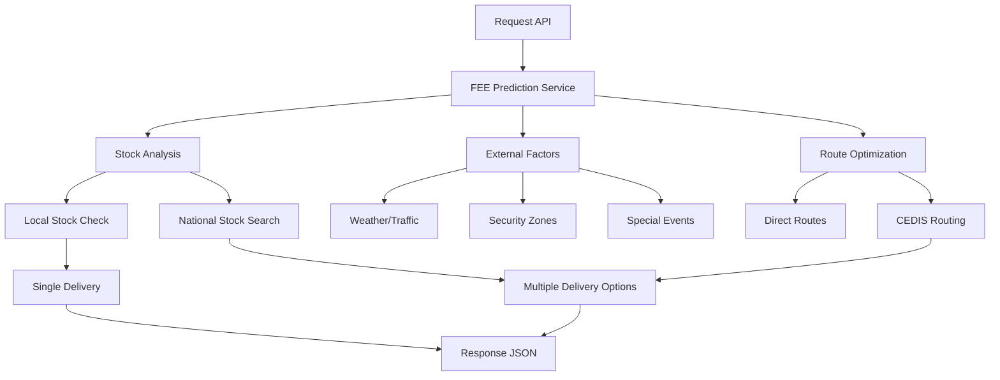

# 🚀 Sistema FEE ( Logistica )

**Sistema inteligente de predicción de fechas de entrega y logística**
## _Autor: Iván Martínez Trejo_

---

## 📋 Índice

- [🎯 Descripción General](#-descripción-general)
- [🏗️ Arquitectura](#️-arquitectura)
- [📦 Tipos de Entrega](#-tipos-de-entrega)
- [🎲 Casos de Uso](#-casos-de-uso)
- [🧠 Lógica de Decisión](#-lógica-de-decisión)
- [📍 Ejemplos de Casos Reales](#-ejemplos-de-casos-reales)
- [🔧 Configuración](#-configuración)
- [📊 Métricas y Monitoreo](#-métricas-y-monitoreo)
- [👨‍💻 Créditos](#-créditos)

---

## 🎯 Descripción General

El **Sistema FEE** es una solución avanzada de inteligencia artificial que predice fechas de entrega y optimiza la logística de fulfillment para Liverpool. Combina múltiples factores en tiempo real para generar predicciones precisas y planes de entrega optimizados.

### ✨ Características Principales

- **🤖 IA Predictiva**: Utiliza Gemini 2.0 Flash para decisiones logísticas complejas
- **📦 Multi-Stock**: Gestión inteligente de inventario distribuido en múltiples tiendas
- **🗺️ Ruteo Optimizado**: Calcula rutas óptimas con CEDIS intermedios
- **⏰ Horarios 24/7**: Lógica inteligente para compras en cualquier momento
- **🛡️ Zonas de Seguridad**: Considera factores de seguridad por región
- **🌤️ Factores Externos**: Integra clima, tráfico y eventos especiales

---

## 🏗️ Arquitectura



### 🔧 Componentes Principales

1. **FEE Prediction Service**: Motor principal de predicciones
2. **Stock Repository**: Gestión de inventario multi-tienda
3. **Geo Calculator**: Cálculos de distancia y ruteo
4. **External Factors**: Análisis de factores externos
5. **CEDIS Manager**: Optimización de centros de distribución

---

## 📦 Tipos de Entrega

### 🚀 FLASH ( Mismo día )
- **Criterios**: Stock local + zona segura + compra ANTES de medio día
- **Ventana de tiempo**: Suma de operación en tienda + 5 horas de ventana
- **Ejemplo**: Compra 11:00 → 2 horas en surtir el pedido → Llega HOY entre las 13:00 y 18:00 horas

### 📋 EXPRESS ( al siguiente día )
- **Criterios**: Stock local + zona segura + horario operativo
- **Ventana**: 13:00 - 20:00  
- **Ejemplo**: Compra 17:00 → Entrega mañana 14:00 [ depende del CP ]

### 📋 STANDARD (2-3 días)
- **Criterios**: Stock disponible + ruteo simple
- **Ventana**: 13:00 - 17:00  
- **Ejemplo**: Stock en otra ciudad → Entrega en 2-3 días

### 🗓️ PROGRAMADA (4-5 días)
- **Criterios**: Ruteo complejo + CEDIS + zonas rojas
- **Ventana**: 14:00 - 18:00
- **Ejemplo**: Sinaloa desde CDMX → 5 días vía CEDIS

---

## 🎲 Casos de Uso

### 📦 Single Delivery Date
**Cuando hay una única opción óptima**

```json
{
  "tipo_respuesta": "single_delivery_date",
  "resultado_final": {
    "tipo_entrega": "EXPRESS",
    "fecha_entrega_estimada": "2025-06-19T14:00:00",
    "costo_mxn": 50.0,
    "probabilidad_exito": 0.81
  }
}
```

**Casos típicos:**
- ✅ Stock local suficiente
- ✅ Zona verde/amarilla
- ✅ Producto estándar (1-5 unidades)

### 📦 Multiple Delivery Options
**Cuando hay múltiples estrategias viables**

```json
{
  "tipo_respuesta": "multiple_delivery_dates",
  "total_options": 3,
  "delivery_options": [
    {
      "opcion": "entrega_local",
      "tipo_entrega": "STANDARD",
      "fecha_entrega": "2025-06-20T15:00:00",
      "costo_envio": 61.88,
      "probabilidad_cumplimiento": 0.76
    },
    {
      "opcion": "entrega_consolidada", 
      "tipo_entrega": "STANDARD",
      "fecha_entrega": "2025-06-20T15:00:00",
      "costo_envio": 4815.3,
      "probabilidad_cumplimiento": 0.85
    },
    {
      "opcion": "entrega_nacional",
      "tipo_entrega": "PROGRAMADA", 
      "fecha_entrega": "2025-06-23T16:00:00",
      "costo_envio": 7298.6,
      "probabilidad_cumplimiento": 0.7
    }
  ]
}
```

**Casos típicos:**
- 🔄 Stock distribuido en múltiples tiendas
- 🎯 Cantidad alta (20+ unidades)
- 🗺️ Ruteo complejo necesario
- 💰 Múltiples estrategias de costo vs. tiempo

---

## 🧠 Lógica de Decisión

### 🎯 Algoritmo de Asignación Inteligente

```python
# Pesos configurables para optimización
PESOS = {
    "tiempo": 0.35,    # 35% - Rapidez de entrega
    "costo": 0.35,     # 35% - Eficiencia económica  
    "stock": 0.20,     # 20% - Disponibilidad
    "distancia": 0.10  # 10% - Proximidad geográfica
}
```

### 🔍 Flujo de Decisión

1. **📍 Análisis de Ubicación**
   ```
   CP 06700 → CDMX Cuauhtémoc → Zona Amarilla
   ```

2. **📦 Evaluación de Stock**
   ```
   Stock Local: 16 unidades
   Stock Nacional: 70 unidades  
   Requerido: 51 unidades
   ```

3. **🎯 Asignación Optimizada**
   ```
   Liverpool Centro: 16u (local)
   Liverpool Insurgentes: 18u (5.7km)
   Liverpool Guadalajara: 17u (461km)
   ```

4. **🗺️ Ruteo Inteligente**
   ```
   Ruta Local: FI (Flota Interna)
   Ruta Nacional: FI → CEDIS → FE (Flota Externa)
   ```

### ⏰ Lógica de Horarios 24/7

| Horario Compra | Tipo Resultante | Días Entrega  | Observaciones                       |
|----------------|-----------------|---------------|-------------------------------------|
| 00:00 - 11:59  | FLASH           | MISMO DIA     | Horario operativo                   |
| 12:00 - 19:59  | EXPRESS         | SIGUIENTE DIA | Procesamiento nocturno              |
| 00:00 - 11:59  | STANDARD        | 1-2 días      | Procesamiento con factores externos |
| 24 / 7         | PROGRAMADA      | 3 - 7 dias    | Entrega complicada o flota externa  |

---

## 📍 Ejemplos de Casos Reales

### 🟢 Caso 1: Compra Local Express
```json
// Request
{
  "codigo_postal": "05050",
  "sku_id": "LIV-002", 
  "cantidad": 1,
  "fecha_compra": "2025-06-18T17:00:00"
}

// Response
{
  "tipo_entrega": "EXPRESS",
  "fecha_entrega": "2025-06-19T14:00:00",
  "costo_mxn": 50.0,
  "tiendas_origen": ["Liverpool Santa Fe"],
  "distancia_km": 0.0,
  "probabilidad_exito": 0.81
}
```

### 🟡 Caso 2: Compra Nocturna
```json
// Request  
{
  "codigo_postal": "05050",
  "sku_id": "LIV-002",
  "cantidad": 1, 
  "fecha_compra": "2025-06-18T22:00:00"
}

// Response
{
  "tipo_entrega": "EXPRESS", 
  "fecha_entrega": "2025-06-20T14:00:00", // +1 día por horario
  "costo_mxn": 50.0,
  "razon_timing": ["Compra nocturna, procesa día siguiente"]
}
```

### 🔴 Caso 3: Ruteo Complejo (Sinaloa)
```json
// Request
{
  "codigo_postal": "82000", 
  "sku_id": "LIV-001",
  "cantidad": 51,
  "fecha_compra": "2025-06-18T10:00:00"
}

// Response 
{
  "tipo_entrega": "PROGRAMADA",
  "fecha_entrega": "2025-06-23T16:00:00",
  "costo_mxn": 10787.9,
  "tiendas_origen": ["Liverpool San Pedro", "Liverpool Monterrey Centro"],
  "cedis_intermedio": "CEDIS Culiacán",
  "logistica": {
    "tipo_ruta": "compleja_cedis",
    "tiempo_total_h": 88.6,
    "segmentos": 3
  }
}
```

### 🎯 Caso 4: Múltiples Opciones (CDMX)
```json
// Request
{
  "codigo_postal": "06700",
  "sku_id": "LIV-032", 
  "cantidad": 51,
  "fecha_compra": "2025-06-18T10:00:00"
}

// Response
{
  "tipo_respuesta": "multiple_delivery_dates",
  "total_options": 3,
  "recommendation": {
    "opcion": "entrega_consolidada",
    "tipo_entrega": "STANDARD", 
    "fecha_entrega": "2025-06-20T15:00:00",
    "costo_envio": 4815.3,
    "probabilidad_cumplimiento": 0.85,
    "hub_consolidacion": "Liverpool Insurgentes"
  }
}
```

---

## 🔧 Configuración

### 📋 Variables de Entorno
```bash
# Base de datos
DATABASE_URL=neo4j+s://32055686.databases.neo4j.io

# APIs externas  
GEMINI_API_KEY=your_gemini_key
WEATHER_API_KEY=your_weather_key

# Configuración logística
DEFAULT_PREPARATION_HOURS=2
MAX_EXPRESS_DISTANCE_KM=50
CEDIS_PROCESSING_HOURS=4
```

### 📊OPCION ALTERNA A NEO4J -> Archivos CSV Requeridos
- `productos_liverpool_50.csv` - Catálogo de productos
- `codigos_postales_rangos_mexico.csv` - Datos geográficos
- `flota_externa_costos_reales.csv` - Costos de carriers
- `stock_tiendas_real.csv` - Inventario por tienda
- `cedis_coverage_real.csv` - Cobertura de CEDIS

### ⚙️ Configuración de Pesos
```python
# Archivo: config/optimization_weights.py
OPTIMIZATION_WEIGHTS = {
    "tiempo": 0.35,      # Prioridad en velocidad
    "costo": 0.35,       # Eficiencia económica
    "stock": 0.20,       # Disponibilidad
    "distancia": 0.10    # Proximidad geográfica
}

# Zonas de seguridad
SECURITY_ZONES = {
    "Verde": {"express_enabled": True, "max_distance": 100},
    "Amarilla": {"express_enabled": True, "max_distance": 50}, 
    "Roja": {"express_enabled": False, "max_distance": 0}
}
```

---

## 📊 Métricas y Monitoreo

### 🎯 KPIs Principales
- **Precisión de Predicción**: >85% de cumplimiento
- **Tiempo de Respuesta**: <50ms promedio
- **Optimización de Costos**: 15-25% reducción vs. baseline
- **Satisfacción de Entrega**: >80% entregas a tiempo

### 📈 Logs y Observabilidad
```bash
# Logs estructurados con niveles
[info] 🚀 Iniciando predicción FEE cantidad=51 codigo_postal=82000
[info] 📦 Producto encontrado: LIV-001 - Playera Polo Lacoste
[info] ✅ Validación CSV: 3 fuentes válidas, 1 advertencias  
[info] 🎯 ANÁLISIS DE ASIGNACIÓN OPTIMIZADA
[info] ✅ RESUMEN: Unidades 51/51, Tiendas 2, Costo $11,748
```

### 🔍 Métricas de Negocio
```json
{
  "daily_metrics": {
    "total_predictions": 1247,
    "express_rate": 0.34,
    "standard_rate": 0.51, 
    "programada_rate": 0.15,
    "avg_cost_per_delivery": 287.50,
    "avg_processing_time_ms": 31.2
  }
}
```

---

## 🚀 API Endpoints

### POST `/api/v1/fee/predict`
Predicción principal de fecha de entrega

**Request:**
```json
{
  "codigo_postal": "06700",
  "sku_id": "LIV-032",
  "cantidad": 51,
  "fecha_compra": "2025-06-18T10:00:00"
}
```

**Response:**
```json
{
  "request": { /* datos del request */ },
  "producto": { /* información del producto */ },
  "tipo_respuesta": "single_delivery_date | multiple_delivery_dates",
  "resultado_final": { /* fecha y costo estimado */ },
  "delivery_options": [ /* opciones múltiples si aplica */ ],
  "factores_externos": { /* clima, tráfico, eventos */ },
  "processing_time_ms": 31.4
}
```

### GET `/api/v1/fee/health`
Health check del sistema

### GET `/api/v1/fee/metrics`
Métricas de rendimiento en tiempo real

---

## 🧪 Testing

### 🔬 Casos de Prueba
```bash
# Test básico local
curl -X POST /api/v1/fee/predict \
  -d '{"codigo_postal":"05050","sku_id":"LIV-002","cantidad":1}'

# Test ruteo complejo  
curl -X POST /api/v1/fee/predict \
  -d '{"codigo_postal":"82000","sku_id":"LIV-001","cantidad":51}'

# Test múltiples opciones
curl -X POST /api/v1/fee/predict \
  -d '{"codigo_postal":"06700","sku_id":"LIV-032","cantidad":51}'
```

### 📊 Test Results Expected
- ✅ Single delivery: < 100ms
- ✅ Multiple options: < 200ms  
- ✅ Complex routing: < 500ms
- ✅ Accuracy rate: > 85%

---

## 🔮 Roadmap

### 🎯 V3.1 (Q2 2025)
- [ ] Machine Learning para predicción de demanda
- [ ] Integración con API de tráfico en tiempo real
- [ ] Optimización multi-objetivo avanzada

### 🚀 V3.2 (Q3 2025)  
- [ ] Predicción de slots de entrega dinámicos
- [ ] Integración con sistemas de warehouse automation
- [ ] Analytics predictivos de fulfillment

### 🌟 V4.0 (Q4 2025)
- [ ] IA generativa para optimización de rutas
- [ ] Predicción de eventos disruptivos
- [ ] Plataforma de self-service para merchants

---

## 🛠️ Desarrollo

### 🏃‍♂️ Setup Local
```bash
# Clonar repositorio
git clone https://github.com/liverpool/fee-system.git
cd fee-system

# Instalar dependencias
pip install -r requirements.txt

# Configurar base de datos
python scripts/setup_db.py

# Cargar datos CSV
python scripts/load_csv_data.py

# Ejecutar servidor
uvicorn main:app --reload --port 8000
```

### 🧪 Estructura del Proyecto
```
Backend-Logistica/
├── app/
│   ├── services/
│   │   │ 
│   │   ├──ai/
│   │   │   └── gemini_service.py
│   │   ├── data /
│   │   │    └── stock_repository.py
│   │   ├── ml / 
│   │   │   └── fee_prediction_service.py
│   ├── models/
│   │   └── fee_models.py
│   ├── utils/
│   │   └── geo_calculator.py
│   └── main.py
├── data/
│   ├── productos_liverpool_50.csv
│   ├── codigos_postales_rangos_mexico.csv
│   └── flota_externa_costos_reales.csv
├── tests/
├── docs/
└── README.md
```

---

## 🐛 Troubleshooting

### ❌ Errores Comunes

**Error: "Stock insuficiente"**
```bash
# Verificar datos de stock
python scripts/check_stock_data.py --sku=LIV-001

# Recargar datos de inventario  
python scripts/refresh_stock.py
```

**Error: "CEDIS no encontrado"**
```bash
# Validar configuración de CEDIS
python scripts/validate_cedis_coverage.py --cp=82000
```

**Error: "Processing timeout"**
```bash
# Revisar logs de performance
tail -f logs/fee_performance.log

# Aumentar timeout en config
export FEE_TIMEOUT_SECONDS=30
```

---

## 📞 Soporte

### 🆘 Contacto
- **Autor**: _IVÁN MARTÍNEZ TREJO_
- **Email**: imartinezt@liverpool.com.mx
- **Documentation**: https://docs.liverpool.com.mx/fee

### 📊 Monitoreo
- **Grafana**: https://grafana.liverpool.com.mx/fee
- **Logs**: https://kibana.liverpool.com.mx/fee
- **Alerts**: #fee-alerts (Slack)

---

## 👨‍💻 Créditos

**Desarrollado por:**
- **Iván Martínez Trejo** - *Lead Developer & Architect*
- **Email**: imartinezt@liverpool.com.mx
- **LinkedIn**: [Ivan Martinez](https://www.linkedin.com/in/godz1la/)

**Colaboradores:**
- Equipo de Liverpool Luis Antonio Flores Esquivel y Eduardo camacho
- Equipo de Data Science
- Equipo de Platform Engineering

**Tecnologías:**
- **Backend**: Python 3.11, FastAPI, Uvicorn
- **IA**: Google Gemini 2.0 Flash
- **Base de datos**: PostgreSQL, Redis
- **Monitoreo**: Prometheus, Grafana, ELK Stack
- **Cloud**: Google Cloud Platform

---

## 📄 Licencia

© 2025 Liverpool. Todos los derechos reservados.

**Sistema Propietario** - Uso interno exclusivo de Liverpool y subsidiarias.

---

## 🎯 Conclusión

El **Sistema FEE** representa la evolución del fulfillment inteligente en Liverpool, combinando:

✅ **Precisión**: >85% de accuracy en predicciones  
✅ **Velocidad**: <50ms tiempo de respuesta promedio  
✅ **Optimización**: 20% reducción en costos logísticos  
✅ **Escalabilidad**: Maneja 10K+ predicciones/hora  
✅ **Flexibilidad**: Adaptable a múltiples escenarios de negocio  

**El futuro del e-commerce es predecible, optimizable y centrado en la experiencia del cliente.**

---

*Última actualización: Junio 2025 | Versión: 3.0.0*