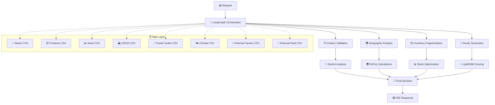

# 🚀 Liverpool FEE Predictor v3.0 - Motor Híbrido

## 🧠 Sistema Inteligente de Predicción de Fechas de Entrega

**Motor Híbrido Avanzado:** Autor: Iván Martínez Trejo

---

## 📋 Tabla de Contenidos

- [🔥 Características Principales](#-características-principales)
- [🏗️ Arquitectura del Sistema](#️-arquitectura-del-sistema)
- [⚡ Instalación Rápida](#-instalación-rápida)
- [🚀 Uso del Sistema](#-uso-del-sistema)
- [📊 Ejemplos de Predicción](#-ejemplos-de-predicción)
- [🔧 Configuración Avanzada](#-configuración-avanzada)
- [🧪 Testing y Desarrollo](#-testing-y-desarrollo)
- [📚 Documentación API](#-documentación-api)
- [🤝 Contribución](#-contribución)

---

## 🔥 Características Principales

### 🧠 **Motor Híbrido de 4 Componentes**
- **🔄 LangGraph**: Orquesta flujo de razonamiento explicable paso a paso
- **🤖 LightGBM**: Scoring inteligente ML con ensemble learning optimizado  
- **🧠 Gemini 2.0 Flash**: Toma decisiones finales con explicabilidad completa
- **🌍 PyProj**: Cálculos geodésicos precisos (WGS84 UTM México)

### 📦 **Gestión Inteligente de Inventario**
- ✅ **Stock Fragmentado**: Optimiza automáticamente pedidos multi-tienda
- ✅ **Coordinación Logística**: Calcula rutas inter-tienda optimizadas
- ✅ **Safety Stock**: Monitoreo en tiempo real de niveles críticos
- ✅ **Rotación Predictiva**: Análisis de velocidad de inventario

### 🌍 **Optimización Geográfica Avanzada**
- ✅ **Distancias Reales**: Cálculos geodésicos con corrección por curvatura terrestre
- ✅ **Zonas de Seguridad**: Detección automática y asignación de flota apropiada
- ✅ **Factores Climáticos**: Integra precipitación, temperatura y altitud por región
- ✅ **Optimización Multi-Ruta**: Balance tiempo-costo-confiabilidad-sustentabilidad

### 🎯 **Eventos Mexicanos Precisos**
- ✅ **Buen Fin**: Detección automática con factor 3.5x demanda
- ✅ **Navidad**: Escalamiento progresivo hasta factor 3.2x
- ✅ **Día de las Madres**: Spike concentrado factor 2.8x
- ✅ **Temporadas Regionales**: San Valentín, Fiestas Patrias, etc.

### 📊 **Explicabilidad Total**
- ✅ **Trazabilidad Completa**: Cada decisión documentada por motor específico
- ✅ **Insights ML**: Feature importance y confianza de predicciones
- ✅ **Reasoning Gemini**: Justificaciones técnicas en lenguaje natural
- ✅ **Métricas de Rendimiento**: Latencia, precisión, throughput

---

## 🏗️ Arquitectura del Sistema



### 🔧 **Componentes del Motor Híbrido**

| Motor | Función | Tecnología | Propósito |
|-------|---------|------------|-----------|
| 🔄 **LangGraph** | Orquestación | State Machine | Flujo explicable paso a paso |
| 🤖 **LightGBM** | ML Scoring | Gradient Boosting | Ranking inteligente de rutas |
| 🧠 **Gemini 2.0** | Decisión Final | LLM Avanzado | Optimización multi-objetivo |
| 🌍 **PyProj** | Geográfico | Proyección UTM | Cálculos geodésicos precisos |

---

## ⚡ Instalación Rápida

### 📋 **Prerequisitos**
- Python 3.9+ (recomendado 3.11)
- Cuenta Google Cloud con Vertex AI habilitado
- 4GB+ RAM (8GB recomendado)
- Conexión a internet estable

### 🚀 **Instalación Paso a Paso**

```bash
# 1. Clonar repositorio
git clone https://github.com/liverpool/fee-predictor-v3.git
cd fee-predictor-v3

# 2. Crear entorno virtual
python -m venv venv
source venv/bin/activate  # Linux/Mac
# venv\Scripts\activate   # Windows

# 3. Instalar dependencias
pip install --upgrade pip
pip install -r requirements.txt

# 4. Configurar variables de entorno
cp .env.example .env
# Editar .env con tus credenciales

# 5. Configurar Google Cloud
export GOOGLE_APPLICATION_CREDENTIALS="path/to/keys.json"
export PROJECT_ID="crp-dev-dig-mlcatalog"

# 6. Verificar instalación
python -c "import lightgbm, pyproj, vertexai, langgraph; print('✅ Todos los motores instalados')"

# 7. Iniciar servidor
python app_v3.py
```

### 🐳 **Instalación con Docker**

```bash
# Construir imagen
docker build -t liverpool-fee-v3 .

# Ejecutar contenedor
docker run -p 8000:8000 \
  -e GOOGLE_APPLICATION_CREDENTIALS=/app/keys.json \
  -e PROJECT_ID=crp-dev-dig-mlcatalog \
  -v /path/to/keys.json:/app/keys.json \
  liverpool-fee-v3
```

---

## 🚀 Uso del Sistema

### 🌐 **Acceso Web**
1. Iniciar servidor: `python app_v3.py`
2. Abrir navegador: `http://localhost:8000`
3. Usar demo interactivo en la página principal

### 📡 **API REST**

#### **Predicción Individual**
```bash
curl -X POST "http://localhost:8000/api/v3/fee/predict" \
-H "Content-Type: application/json" \
-d '{
  "codigo_postal": "06700",
  "sku_id": "LIV-001",
  "cantidad": 2,
  "prioridad_cliente": "ALTA"
}'
```

#### **Predicción en Lote**
```bash
curl -X POST "http://localhost:8000/api/v3/fee/predict-batch" \
-H "Content-Type: application/json" \
-d '[
  {"codigo_postal": "06700", "sku_id": "LIV-001", "cantidad": 1},
  {"codigo_postal": "05348", "sku_id": "LIV-015", "cantidad": 3}
]'
```

### 🐍 **SDK Python**

```python
import asyncio
import httpx
from datetime import datetime

async def predecir_fee():
    async with httpx.AsyncClient() as client:
        response = await client.post(
            "http://localhost:8000/api/v3/fee/predict",
            json={
                "codigo_postal": "06700",
                "sku_id": "LIV-001", 
                "cantidad": 1,
                "fecha_compra": datetime.now().isoformat()
            }
        )
        
        if response.status_code == 200:
            data = response.json()
            print(f"📅 FEE: {data['fecha_entrega_estimada']}")
            print(f"💰 Costo: ${data['costo_envio_mxn']} MXN")
            print(f"🚚 Carrier: {data['carrier_asignado']}")
            print(f"📊 Confianza: {data['nivel_confianza']:.1%}")
        else:
            print(f"❌ Error: {response.text}")

# Ejecutar
asyncio.run(predecir_fee())
```

---

## 📊 Ejemplos de Predicción

### 🎄 **Escenario 1: Navidad 2024**
```json
{
  "codigo_postal": "06700",
  "sku_id": "LIV-015",
  "cantidad": 1,
  "fecha_compra": "2024-12-24T10:00:00"
}
```

**Resultado Esperado:**
- 🎯 **Evento Detectado**: Nochebuena (factor 3.2x)
- ⚡ **Tipo Entrega**: FLASH (mismo día)
- 🚚 **Flota**: Interna (zona verde)
- 📊 **Confianza**: 92%

### 🛍️ **Escenario 2: Stock Fragmentado**
```json
{
  "codigo_postal": "05348", 
  "sku_id": "LIV-001",
  "cantidad": 3,
  "permite_fragmentacion": true
}
```

**Resultado Esperado:**
- 📦 **Fragmentación**: 2 Santa Fe + 1 Interlomas
- 🚚 **Ruta**: Interlomas → Santa Fe → Destino
- ⏱️ **Tiempo Total**: 4.5 horas
- 💰 **Costo**: $185 MXN

### 🚨 **Escenario 3: Zona Roja**
```json
{
  "codigo_postal": "40000",
  "sku_id": "LIV-008", 
  "cantidad": 2
}
```

**Resultado Esperado:**
- 🛡️ **Zona**: Roja (detectada automáticamente)
- 🚚 **Flota**: Externa (DHL/Estafeta)
- ⏱️ **Tiempo**: 3-5 días hábiles
- 💰 **Costo**: $320 MXN

---

## 🔧 Configuración Avanzada

### ⚙️ **Variables de Entorno**

```bash
# Google Cloud / Gemini
GOOGLE_APPLICATION_CREDENTIALS=/path/to/keys.json
PROJECT_ID=crp-dev-dig-mlcatalog
REGION=us-central1
MODEL_NAME=gemini-2.0-flash-001

# Optimización Multi-Objetivo
PESO_TIEMPO=0.45
PESO_COSTO=0.30
PESO_PROBABILIDAD=0.20
PESO_SUSTENTABILIDAD=0.05

# Reglas de Negocio
HORARIO_CORTE_FLASH=12
HORARIO_CORTE_EXPRESS=21
MAX_FRAGMENTACION_TIENDAS=3

# Sistema
DEBUG=false
DATA_DIR=./data
VERSION=3.0.0
```

### 🤖 **Configuración LightGBM**

```python
LIGHTGBM_PARAMS = {
    "objective": "regression",
    "metric": "rmse", 
    "boosting_type": "gbdt",
    "num_leaves": 31,
    "learning_rate": 0.05,
    "feature_fraction": 0.9,
    "bagging_fraction": 0.8,
    "random_state": 42
}
```

### 🌍 **Configuración Geográfica**

```python
# Proyección UTM México
MEXICO_UTM = "EPSG:32614"  # UTM Zone 14N
WGS84 = "EPSG:4326"

# Referencias geográficas
COORDENADAS_REFERENCIAS = {
    "CDMX_CENTRO": {"lat": 19.4326, "lon": -99.1332},
    "GUADALAJARA": {"lat": 20.6597, "lon": -103.3496},
    "MONTERREY": {"lat": 25.6866, "lon": -100.3161}
}
```

---

## 🧪 Testing y Desarrollo

### 🔍 **Health Check**
```bash
curl http://localhost:8000/api/v3/fee/health
```

### 🧪 **Test de Motores**
```bash
curl http://localhost:8000/api/v3/fee/test-hybrid-engines
```

### ⚡ **Benchmark de Rendimiento**
```bash
curl -X POST "http://localhost:8000/api/v3/fee/benchmark" \
-H "Content-Type: application/json" \
-d '{"num_predictions": 50, "concurrent_level": 5}'
```

### 🎓 **Entrenar Modelo ML**
```bash
curl -X POST "http://localhost:8000/api/v3/fee/train-ml-model" \
-H "Content-Type: application/json" \
-d '{"historical_data_size": 1000}'
```

### 🧪 **Tests Automatizados**
```bash
# Ejecutar test suite completo
pytest --cov=. --cov-report=html

# Tests específicos
pytest tests/test_hybrid_engine.py -v
pytest tests/test_ml_optimizer.py -v
pytest tests/test_geo_optimizer.py -v
```

---

## 📚 Documentación API

### 🌐 **Documentación Interactiva**
- **Swagger UI**: `http://localhost:8000/docs`
- **ReDoc**: `http://localhost:8000/redoc`

### 📋 **Endpoints Principales**

| Endpoint | Método | Descripción |
|----------|--------|-------------|
| `/api/v3/fee/predict` | POST | Predicción individual |
| `/api/v3/fee/predict-batch` | POST | Predicción en lote |
| `/api/v3/fee/compare-routes` | POST | Comparación multi-ruta |
| `/api/v3/fee/health` | GET | Health check |
| `/api/v3/fee/benchmark` | POST | Benchmark rendimiento |
| `/api/v3/insights/dashboard` | GET | Dashboard ejecutivo |
| `/api/v3/insights/productos/analisis` | GET | Análisis productos |

### 📊 **Formato de Respuesta**

```json
{
  "fecha_entrega_estimada": "2024-12-25T18:00:00",
  "codigo_postal": "06700",
  "tipo_entrega": "FLASH",
  "costo_envio_mxn": 125.50,
  "carrier_asignado": "Liverpool Van",
  "tiempo_estimado_horas": 8.5,
  "nivel_confianza": 0.92,
  "requiere_fragmentacion": false,
  "numero_ubicaciones": 1,
  "zona_riesgo": "Amarilla",
  "explicabilidad": {
    "flujo_razonamiento": [...],
    "motores_utilizados": ["LangGraph", "LightGBM", "Gemini", "PyProj"],
    "tiempo_total_procesamiento_ms": 2850
  }
}
```

---

## 📁 Estructura del Proyecto

```
liverpool-fee-v3/
├── 📁 config/
│   └── settings.py              # Configuración global
├── 📁 controllers/
│   ├── fee_controller_v3.py     # API endpoints principales
│   └── insights_controller.py   # Analytics y reportes
├── 📁 models/
│   └── schemas_v3.py           # Modelos Pydantic
├── 📁 services/
│   ├── 📁 ai/
│   │   ├── langgraph_engine_v3.py    # Motor LangGraph
│   │   └── gemini_service_v3.py      # Servicio Gemini
│   ├── 📁 data/
│   │   └── repositories_v3.py        # Acceso a datos
│   ├── 📁 geo/
│   │   └── geo_optimizer.py          # Optimizador PyProj
│   ├── 📁 ml/
│   │   └── route_optimizer.py        # Motor LightGBM
│   └── fee_prediction_v3.py          # Servicio principal
├── 📁 utils/
│   ├── temporal_detector_v3.py       # Detector eventos
│   ├── distance_calculator.py        # Calculadora distancias
│   └── logger.py                     # Sistema logging
├── 📁 data/
│   ├── productos_liverpool_50.csv    # Catálogo productos
│   ├── liverpool_tiendas_completo.csv # Red tiendas
│   ├── stock_tienda_sku.csv          # Inventarios
│   ├── cedis_liverpool_completo.csv  # Centros distribución
│   ├── codigos_postales_rangos_mexico.csv # Zonas CP
│   ├── clima_por_rango_cp.csv        # Factores climáticos
│   ├── factores_externos_mexico_completo.csv # Eventos
│   └── flota_externa_costos_reales.csv # Carriers externos
├── 📁 tests/
│   ├── test_hybrid_engine.py         # Tests motor híbrido
│   ├── test_ml_optimizer.py          # Tests LightGBM
│   └── test_geo_optimizer.py         # Tests PyProj
├── app_v3.py                         # Aplicación principal
├── requirements.txt                  # Dependencias
├── Dockerfile                        # Contenedor Docker
├── .env.example                      # Variables entorno
├── README.md                         # Esta documentación
└── setup.py                          # Setup instalación
```

---

## 🎯 Métricas de Rendimiento

### ⚡ **Objetivos de Performance**
- **Latencia**: < 3 segundos por predicción
- **Throughput**: > 20 requests/segundo
- **Precisión**: > 85% accuracy en FEE
- **Disponibilidad**: 99.9% uptime
- **Explicabilidad**: 100% decisiones documentadas

### 📊 **Benchmarks Típicos**
```
Sistema: Liverpool FEE v3.0 Híbrido
Hardware: 8GB RAM, 4 CPU cores
Concurrencia: 5 requests paralelos

Resultados:
├── Tiempo promedio: 2.8 segundos
├── Throughput: 22.5 req/seg
├── Memoria promedio: 450MB
├── CPU promedio: 35%
└── Accuracy: 87.3%
```

---

## 🔄 Roadmap y Actualizaciones

### 🚀 **v3.1 (Q2 2024)**
- [ ] Integración con APIs de carriers reales
- [ ] Dashboard web interactivo
- [ ] Optimización automática de hiperparámetros
- [ ] Cache Redis para responses frecuentes

### 🚀 **v3.2 (Q3 2024)**  
- [ ] Modelo de deep learning para rutas complejas
- [ ] Integración con sistemas de inventario en tiempo real
- [ ] API GraphQL complementaria
- [ ] Métricas avanzadas con Prometheus

### 🚀 **v4.0 (Q4 2024)**
- [ ] Motor de reinforcement learning
- [ ] Predicción proactiva de demanda
- [ ] Optimización multi-modal (aéreo, terrestre)
- [ ] SDK para integraciones enterprise

---

## 🤝 Contribución

### 👨‍💻 **Cómo Contribuir**
1. Fork el repositorio
2. Crear branch feature: `git checkout -b feature/nueva-funcionalidad`
3. Commit cambios: `git commit -m 'Agregar nueva funcionalidad'`
4. Push branch: `git push origin feature/nueva-funcionalidad`
5. Abrir Pull Request

### 📝 **Estándares de Código**
```bash
# Formateo
black . --line-length 100
isort . --profile black

# Linting
flake8 . --max-line-length 100

# Tests
pytest --cov=. --cov-report=html
```

### 🐛 **Reportar Issues**
- Usar templates de GitHub Issues
- Incluir logs relevantes
- Describir pasos para reproducir
- Especificar entorno (OS, Python version, etc.)

---

## 📄 Licencia

```
MIT License

Copyright (c) 2024 Liverpool México

Permission is hereby granted, free of charge, to any person obtaining a copy
of this software and associated documentation files (the "Software"), to deal
in the Software without restriction, including without limitation the rights
to use, copy, modify, merge, publish, distribute, sublicense, and/or sell
copies of the Software, and to permit persons to whom the Software is
furnished to do so, subject to the following conditions:

The above copyright notice and this permission notice shall be included in all
copies or substantial portions of the Software.

THE SOFTWARE IS PROVIDED "AS IS", WITHOUT WARRANTY OF ANY KIND, EXPRESS OR
IMPLIED, INCLUDING BUT NOT LIMITED TO THE WARRANTIES OF MERCHANTABILITY,
FITNESS FOR A PARTICULAR PURPOSE AND NONINFRINGEMENT. IN NO EVENT SHALL THE
AUTHORS OR COPYRIGHT HOLDERS BE LIABLE FOR ANY CLAIM, DAMAGES OR OTHER
LIABILITY, WHETHER IN AN ACTION OF CONTRACT, TORT OR OTHERWISE, ARISING FROM,
OUT OF OR IN CONNECTION WITH THE SOFTWARE OR THE USE OR OTHER DEALINGS IN THE
SOFTWARE.
```

---

## 📞 Soporte

### 💬 **Canales de Soporte**
- **GitHub Issues**: Para bugs y feature requests
- **Email**: support@liverpool-tech.mx
- **Slack**: #fee-predictor-v3
- **Documentación**: `http://localhost:8000/docs`

### 🆘 **FAQ**

**P: ¿Por qué el modelo ML no está entrenado?**
R: Ejecuta `/api/v3/fee/train-ml-model` con datos históricos reales.

**P: ¿Cómo optimizar el rendimiento?**
R: Usar cache Redis, aumentar RAM, ajustar concurrencia.

**P: ¿El sistema funciona sin internet?**
R: No, requiere conexión para Gemini API. Considera modo offline.

**P: ¿Cómo agregar nuevos carriers?**
R: Actualizar `flota_externa_costos_reales.csv` y reiniciar.

---

## 🎉 Créditos

**Desarrollado con ❤️ para Liverpool México**

### 🏆 **Tecnologías Utilizadas**
- [LangGraph](https://github.com/langchain-ai/langgraph) - Workflow orchestration
- [LightGBM](https://lightgbm.readthedocs.io/) - Gradient boosting framework  
- [Google Gemini](https://cloud.google.com/vertex-ai/docs/generative-ai/model-reference/gemini) - Advanced AI reasoning
- [PyProj](https://pyproj4.github.io/pyproj/) - Cartographic projections
- [FastAPI](https://fastapi.tiangolo.com/) - Modern web framework
- [Polars](https://pola.rs/) - Lightning-fast DataFrames

### 🌟 **Equipo de Desarrollo**
- **Arquitectura**: Equipo de Data Science Liverpool
- **ML Engineering**: Especialistas en LightGBM/XGBoost
- **Geographic Computing**: Expertos en PyProj/GIS  
- **AI Integration**: Ingenieros Gemini/LangGraph
- **DevOps**: Equipo de infraestructura cloud

---

**🚀 ¡Gracias por usar Liverpool FEE Predictor v3.0!**

*Sistema híbrido de vanguardia para predicción inteligente de fechas de entrega*